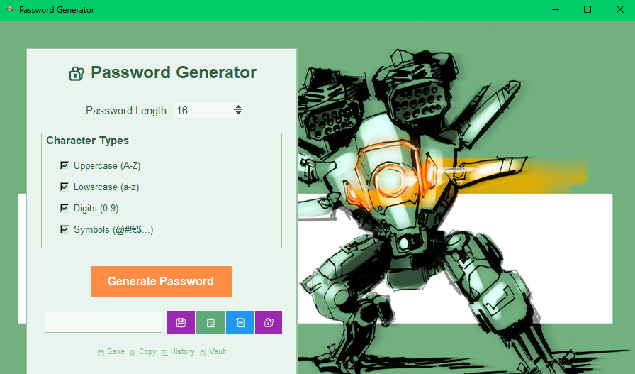
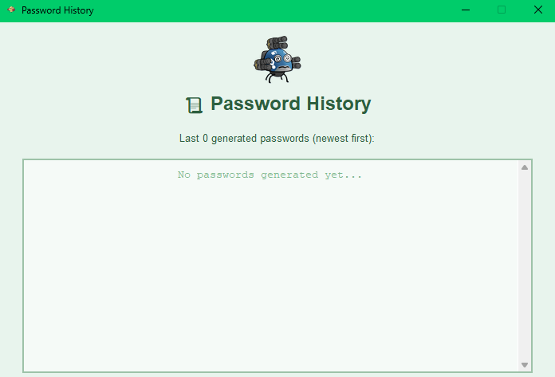
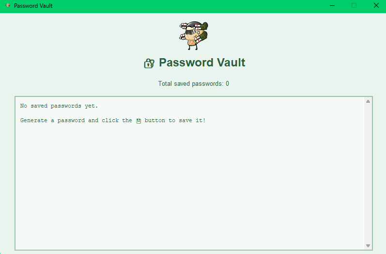

# 🔐 Password Generator con Python

Un generador de contraseñas seguro y moderno con interfaz gráfica, historial de sesión y bóveda encriptada.


## ✨ Características

- 🔐 **Generación segura** - Usa el módulo `secrets` de Python para generación criptográficamente segura
- 📏 **Personalizable** - Longitud de 4 a 128 caracteres (no recomiendo bajo ningún concepto hacer uso de 4 carácteres, por favor usen 8 como mínimo)
- 🎛️ **Tipos de caracteres** - Mayúsculas, minúsculas, números y símbolos
- 📋 **Copiar al portapapeles** - Un clic para copiar
- 📜 **Historial de sesión** - Últimas 10 contraseñas generadas, este historial se borra automáticamente en cuanto se cierra la aplicación
- 🔒 **Bóveda encriptada** - Guarda contraseñas con etiquetas usando encriptación AES-256
- 🎨 **Interfaz llamativa** - Tema verde menta 
- 🪟 **Ejecutable independiente** - No requiere Python instalado

## 🖼️ Capturas de pantalla

### Ventana Principal


### Historial de Contraseñas


### Bóveda de Contraseñas


## 🚀 Instalación

### Opción 1: Ejecutar el .exe (Windows)

1. Descarga `PasswordGenerator.exe` desde [Releases](../../releases)
2. Ejecuta el archivo
3. ¡Listo! No necesitas instalar nada más

### Opción 2: Ejecutar desde código fuente

1. **Clona el repositorio:**
```bash
git clone https://github.com/tuusuario/Password-Generator-con-Python.git
cd Password-Generator-con-Python
```

2. **Instala las dependencias:**
```bash
pip install -r requirements.txt
```

3. **Ejecuta la aplicación:**
```bash
python passwordmanager.py
```

## 🛠️ Crear el ejecutable

Si quieres crear tu propio ejecutable:

```bash
python -m PyInstaller --onefile --windowed --icon=icon.ico --name="PasswordGenerator" --add-data "background.png;." --add-data "icon.png;." --add-data "history_icon.png;." --add-data "vault_icon.png;." passwordmanager.py
```

El ejecutable estará en la carpeta `dist/`.

## 📚 Uso

### Generar una contraseña

1. Selecciona la longitud deseada
2. Marca los tipos de caracteres que quieres incluir
3. Haz clic en **"Generate Password"**
4. Usa los botones:
   - 💾 **Save** - Guardar con etiqueta en la bóveda encriptada
   - 📋 **Copy** - Copiar al portapapeles
   - 📜 **History** - Ver historial de la sesión
   - 🔐 **Vault** - Ver todas las contraseñas guardadas

### Guardar contraseñas

1. Genera una contraseña
2. Haz clic en el botón 💾
3. Escribe una etiqueta (ej: "Gmail", "Banco", "WiFi")
4. Haz clic en **Save**

Las contraseñas se guardan encriptadas con AES-256 en `password_vault.encrypted`.

### Seguridad

⚠️ **IMPORTANTE**: El archivo `password_vault.key` es tu clave de encriptación. 
- 🔒 **NO lo compartas** con nadie
- 💾 **Guarda un backup** en un lugar seguro
- 🗑️ Si lo pierdes, no podrás recuperar tus contraseñas guardadas

## 🧰 Tecnologías utilizadas

- **Python 3.x**
- **Tkinter** - Interfaz gráfica
- **Pillow (PIL)** - Manejo de imágenes
- **Cryptography** - Encriptación AES-256
- **PyInstaller** - Creación del ejecutable

## 📁 Estructura del proyecto

```
Password-Generator-con-Python/
├── passwordmanager.py          # Aplicación principal
├── background.png              # Fondo del robot Carnage
├── icon.png                    # Icono principal (personaje)
├── icon.ico                    # Icono para Windows
├── history_icon.png            # Fujin (historial)
├── vault_icon.png              # GL.Patton (bóveda)
├── requirements.txt            # Dependencias
└── README.md                   # Este archivo
```

## 🤝 Contribuir

¡Las contribuciones son bienvenidas! Si quieres mejorar el proyecto:

1. Haz un Fork
2. Crea una rama (`git checkout -b feature/mejora`)
3. Commit tus cambios (`git commit -m 'Añadir nueva característica'`)
4. Push a la rama (`git push origin feature/mejora`)
5. Abre un Pull Request

## 📝 Licencia

Este proyecto es de código abierto bajo la licencia MIT. Ver [LICENSE](LICENSE) para más detalles.

## 👨‍💻 Autor

**Pablo Díaz Jiménez** - https://github.com/kramorant

## 🎨 Créditos

- Diseño de robots y fondo pertenecen a sus respectivos autores
- Proyecto educativo para aprender Python y GUI

## ⭐ ¿Te gusta el proyecto?

¡Dale una estrella en GitHub! ⭐

---

**Nota**: Este proyecto es meramente experimental para aprender conceptos básicos en Python, desarrollando una aplicación de escritorio básica para la generación de contraseñas de forma aleatoria. Y por cierto, para lo que son los emoticonos de este README tuve que hacer uso de una IA porque no tengo ni idea de como implementarlos en PC.
